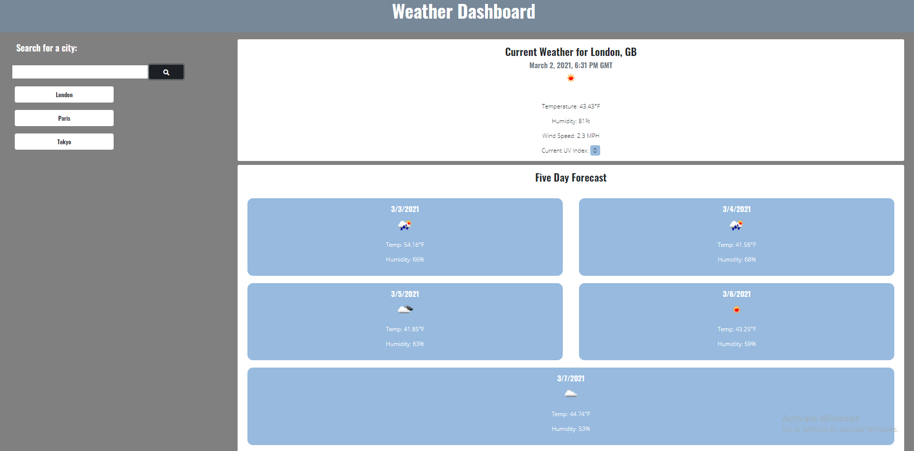
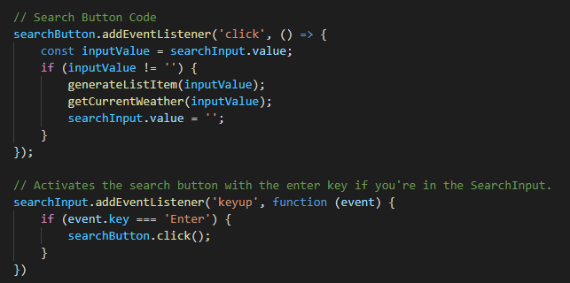
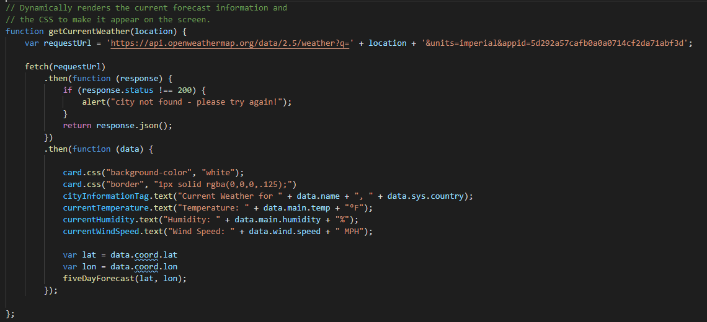
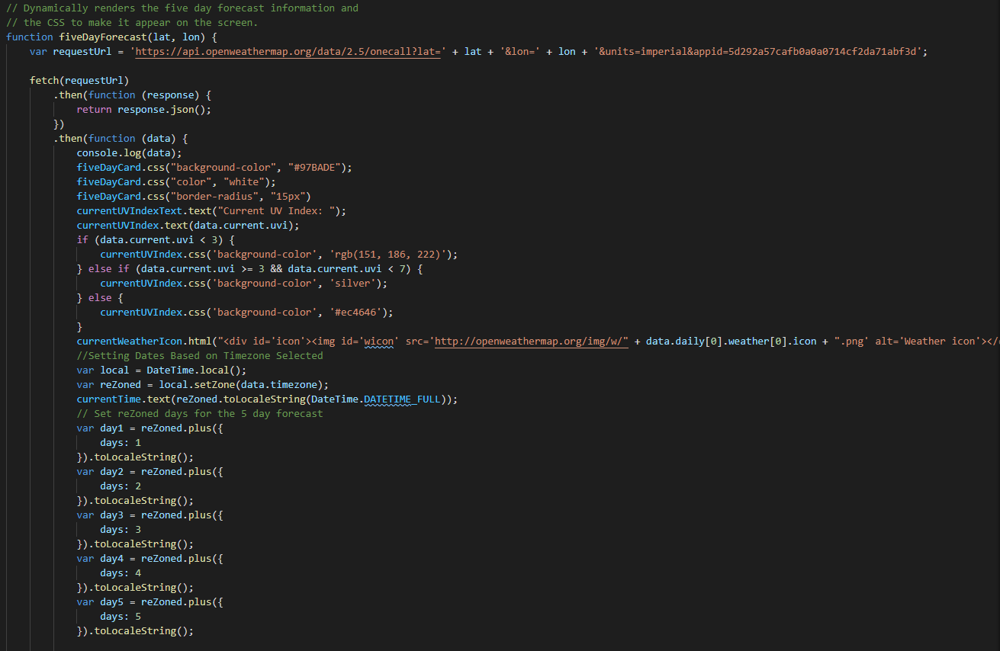
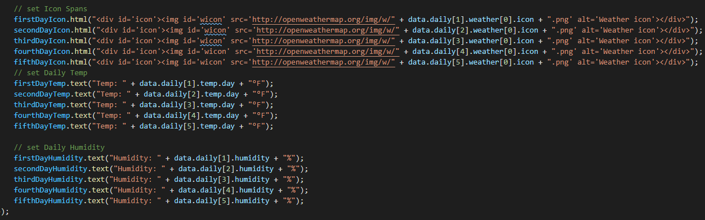
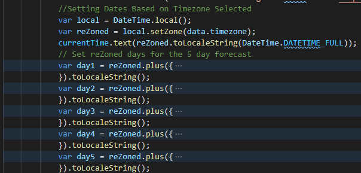
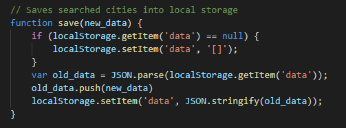
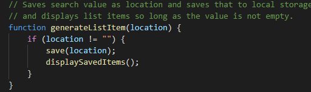
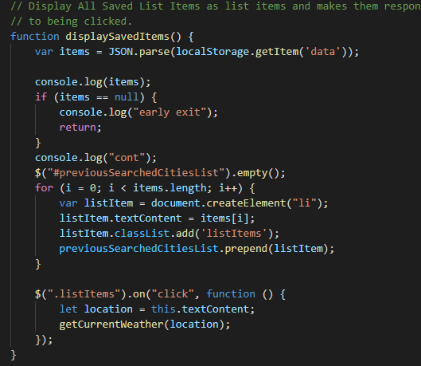

# Weather Dashboard

https://seanmonaghan.github.io/weatherApp/

## Description

This app utilizes third party APIs to gather information regarding the weather and date to provide the user a weather dashboard that they can see the current weather and a five day forecast, while also having their search queries saved in a list for easy access.  The app utilizes jQuery to dynamically update the HTML and CSS based on the city selection of the user.

The weather data obtained by this app comes from OpenWeather Api and the date information is generated using Luxon.js.  The saved list items will persist via local storage so that the user can leave and return and have their previously saved searches there when they get back.

## Ideal User

```
This application is aimed at a user who will be doing 
some traveling and wants to see the weather outlook for multiple cities
so that they can plan their trip accordingly.  
```

## Site Overview



```
The user is initially presented with a search bar prompting them to enter the name
of a city, with a heading informing them that this is a Weather Dashboard.  The page
is bare other than this to direct the users attention to the search bar and make the 
process more intuitive.  
```


```

When the user enters a city into the search bar and either presses the search button or
hits the enter key, two sections will be filled with information regarding the weather
conditions, as shown in the first image. If the city is able to be fetched by the API call,
it will alert the user with a message informing them as such.  

```




```
The weather conditions that are relayed to the user include temperature, humidity, wind speed
and the UV Index both currently and a five day forecast.  The UV Index is colored blue, grey,
or red to distinguish the danger level.  0-3 is blue to denote favorable, 3-7 gray to denote moderate
and above that it will show red to denote severe.  A weather icon is also present to give an overall
representation of the weather conditions.

```





```

To ensure that the times and dates provided are accurate to the region searched, Luxon.js is 
used to ascertain the timezone and make the calculations accordingly.  

```



```
In addition to displaying the weather, searching for a city will also generate a list item that is
displayed below the search bar.  These list items are saved into local storage so they will persist and 
be regenerated when the user returns to the site using the load function.  These list items will also execute the getWeather function
upon being clicked to bring up the weather information for that city.

```





